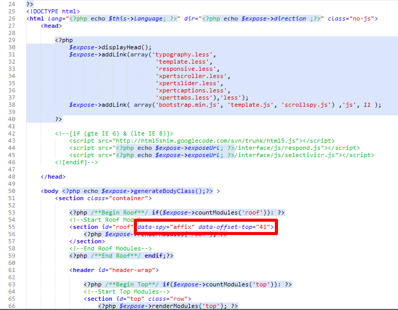

Some of our templates like : Optimus, Bolt uses fixed scrolling header and its very easy to turned off. Open *__index.php__* file under templates root and search for this code ```data-spy="affix"``` now remove it along with the ```data-offset-top="41"``` code.
*Hint: ```data-offset-top``` may vary template to template*

