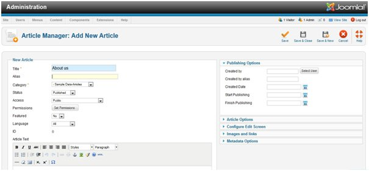

Login to your Joomla admin panel, then go to `Content => Article Manager => Add new Article`

###Explain

1. **Title** = give your article name in Title
1. **Alias** = Leave this blank & Joomla will fill in a default value from the title. This value will depend on SEO(search engine optimization) setting.
1. **Category** = we select a category from the menu.
1. **Status** = set publication status from the menu.
1. **Permissions** = set permissions
1. **Featured** =assign the article to the featured blog layout yes/No.
1. **Language** = Assign language in this category.
1. **ID** = record number in the database.
Now click Save & close icon.
