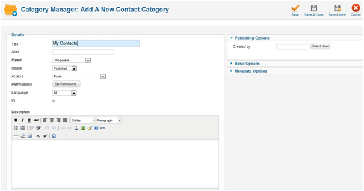

Open your Joomla admin area and navigate to `Components -> Contacts -> Categories`

Click New icon. Give the Title name then Save.

Now return to `Components -> Contacts -> Contacts`

Click on the New icon to begin the setup of your Contact us page.

Enter the required values in the corresponding fields. Review the options listed in the right part of the page and set them per your needs. In order to receive a copy of the contact form inquiries, enter an e-mail address in the `Contact details` list. Now Save the Contact Us page setup. Now go `Menus -> Main Menu`

to publish it. Click on `Add New Menu Item`

Select Menu Item type from the corresponding dialog.

Enter the name to `Menu Title` that will display in the Menu. Set the other options that are not mandatory per your requirements. Save the new menu item and check it from the front end.