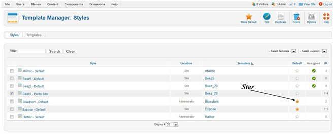
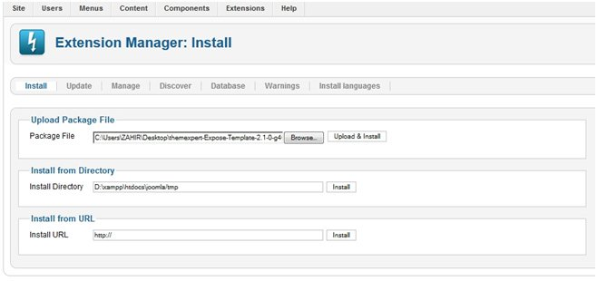

Log in to your joomla website admin panel. Go to `Extensions => Template manager`

The default template for the Front-end is marked with a star.

To change the default template to `Beez2-Parks Site` Select checkbox button left from the template name to select it. Click Make Default on the toolbar. Now, to see this change, go your home page and refresh.

You also can upload template if you already download template from the web.

To do this log in to your joomla website admin panel. Go to `Extensions => Extension manager`

Click upload package file and select your downloaded template which you want to upload.

Click upload & install. Now go to `Extensions => Template manager`

The default template for the Front-end is marked with a star. To change the default template which you already installed select checkbox button left from the template name to select it (the new template name which you have already uploaded). Click `Make Default` on the toolbar. Now, to see this change, go your home page and refresh.