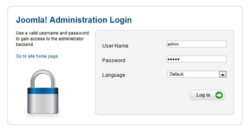

At first Login from your Site Administrator.

Then go `Content => Category Manager => Add new category`

###Explain

1. **Title** = Give any title name.
1. **Alias** = Leave this blank & Joomla will fill in a default value from the title. This value will depend on SEO(search engine optimization) setting.
1. **Parent** = select a parent category from the list.
1. **Status** = Set publication status from the list. If the article is not published, it will not be shown to your visitors.
1. **Access** = the access level allowed to view this item to another.
1. **Permissions** = Manage the permission settings for the user groups below. See notes at the bottom.
1. **Language** = Assign language in this category.
1. Then click save & close.