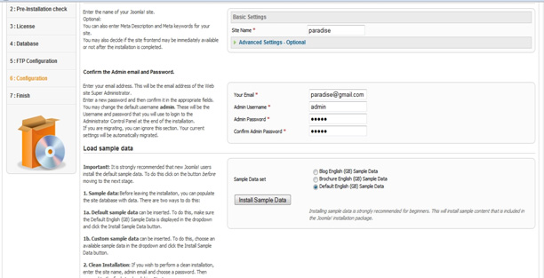
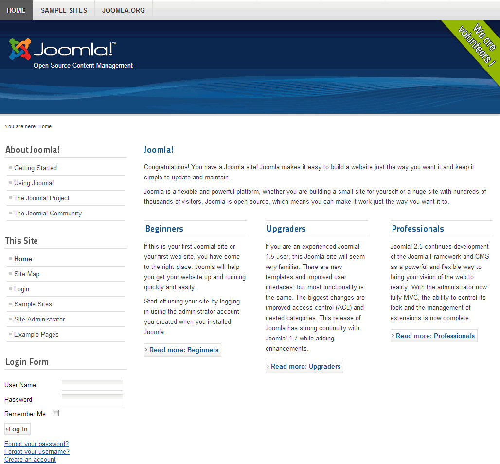

According to install Joomla! On your PC, it is necessary to connect your own internet, for which you'll need a browser, a web server, a PHP environment and as well a Joomla supported database system. We call this a LAMP(Linux, Apache, My SQL, PHP) stack (or XAMP) and there is many client server available for Window, Mac and Linux, eg: XAMPP, AMP, MAMP etc. In this tutorial we'll give you example of how to install and configure joomla on XAMPP. The Joomla! Files will be copied to this system and configured with the Joomla! web installer.

##XAMPP Setup
----------
In order to install Joomla! At first install XAMPP for Joomla run to set up a server on your own computer. (You can also install Joomla on the web for trial, www.demo.joomla.org)

1. To create a local server to your PC Download the latest XAMPP installer for your version of Windows from the XAMPP site: [http://www.apachefriends.org/](http://www.apachefriends.org/)

1. After downloading XAMPP, run the setup and follow the given instructions. Installing Apache and MySQL as services are recommended.

You can install XAMPP to other drive for future folder safety (like windows crash).

If firewall wants to block any features, click unblock all features.

After complete installation, run XAMPP Control Panel from desktop.

Click start for Apache & MySQL from Actions.

(If does not start Apache or mysql after clicking, please exit your internet messenger like Skype for those times)

Now minimize it to the taskbar. Now let us go get Joomla! for Setup.

##Download & Unzip Joomla!
----------

At first, we need to make a folder for Joomla!. Open the folder that you installed XAMPP into – usually `C:\XAMPP` or `C:\Program Files\XAMPP` on Windows.

Open up the folder `htdocs` Create a new folder in htdocs titled `joomla`

Now we download Joomla!2.5 or 3.0 From the this url [http://www.joomla.org/download.html](http://www.joomla.org/download.html)

After completing the download, use your favorite program to `unzip/extract` the files into the `joomla` directory that we created in `htdocs`

Now we are ready to setup Joomla!

1. Open your default internet browser.
1. Type in the address bar http://localhost/joomla then press Enter
1. Now select your desired language, and click the Next button.

4 . Pre-installation check

The Pre-installation check should help you verify whether your server environment is suitable for the installation of Joomla! or not. It's a good sign if you see mostly green test results. Depending on your configuration, there can be differences.

5 . Then click the Next button and you will get to the step License

All software products contain a license describing the allowed usage. Joomla! is licensed according to the GNU General Public License, version 2.0

6 . Database configuration

On the `Database Configuration` page, enter the details, then press Next. The user root is the MySQL administrator and can, therefore, do everything in your MySQL system. The password depends on your server environment (no password is needed with XAMPP, with MAMP the password is root too).

7 . FTP configuration

n order to avoid problems with access rights and possibly turned on PHP Safe Mode, you have the possibility to use the FTP functions of PHP for the upload and file handling. This is not necessary in a local installation.

8 . Main configuration
- In this step, give your site name in Basic setting.
- Then give your email address, user name & password.
- For new and starter user, you can click Install Sample Data button to get all dummy data inside your Joomla installation.
- Now click Install sample data.
- Now Click on the button NEXT and the data will be transferred.

9 . Finish

In this step, you will be congratulated on having successfully installed Joomla!

You will now see an advisory message appearing in the display, prompting you to delete the directory called `Installation` You should follow this advisory because your Joomla! website will otherwise not run properly.

Now you have successfully installed Joomla! you can begin configuring your website and content. Click on Site to view your newly created website!

