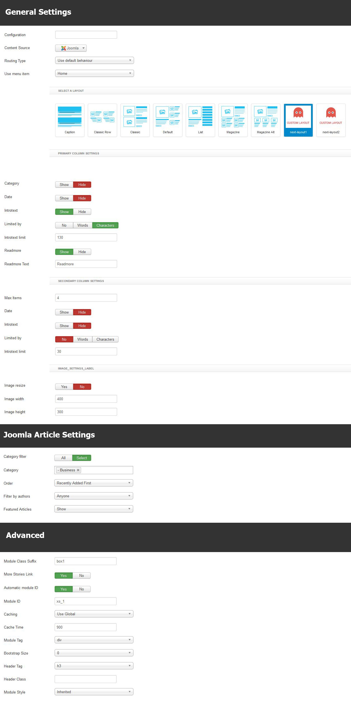
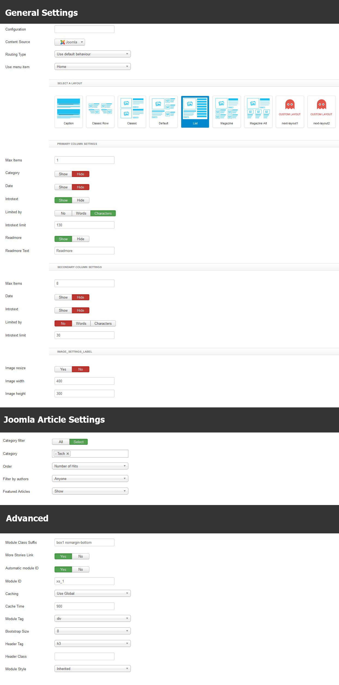
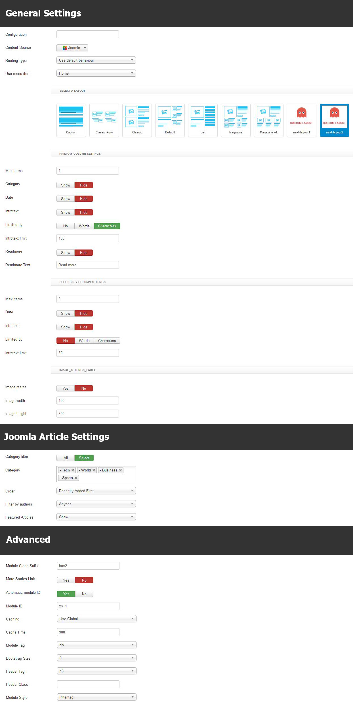

This documentation will flip you  through the step by step how to install and setup the incredible Egan WordPress theme.  Egan is an responsive news and magazine theme for WordPress lovers, those who are looking for a indispensable media to share their discoveries and latest news.

This beautiful news WordPress theme is neat and clean, well-equipped with innumerous technologies Like Bootstrap 3, Less, Newskit, and a lot more.

## Installation

Installing Egan WordPress theme is the same as the other, you can either install via FTP or WordPress uploader from wordpress backend.

If you don’t have WordPress install in your server, you can install our QuickStart pack, that are incorporated with required dependency like plugins, demo data, every wordpress itself. Just download the quickstart zip file and you are ready to go.

## Install Tx Egan via FTP

*__Step 01 -__* Download the zip file of Egan theme titled Egan_UNZIPFIRST.zip, make sure you have properly extracted the theme. Remember only extracted theme going works smartly in server. When you unzip the Egan_UNZIPFIRST.zip, Egan folder comes up. Get into the egan folder, you will find the following folder.

- Licensing
- Plugins
- Quickstart
- Themes

*__Step 02 -__* Now open the Themes folder, extrect the tx-egan.zip file. Now Head over to the Hosting via FTP client, upload the extracted tx-egan theme in themes folder of WordPress via __WordPress >> wp-content >> themes__.

*__Step 03 -__* When you’ve done, log in WordPress backend and activate Tx Egan Theme via __Dashboard >> Appearance >> Themes__

## Plugins Installation

After properly activating WordPress, you will be redirected to the welcome screen of Tx Egan theme, and notified with a massage to inform recommended and indispensable plugins. They are NewsKit, Max Mega Menu. 

![image]
The above message indicated that you can select buttons either. But click on the __Begin installing plugins__ install you all the plugins, not activate those. 

![image]
After checking all plugins, select install for apply dropdown, and click apply button. The subsequent step printed in the following. 

![image]
Now check again all available plugins, select Active from Apply dropdown, and click Apply. It will take couple of second to be installed.
Note: You must install the required plugin and recommended depends on you choice. 


## Homepage Settings (Without Installing Demo Data)

*__Step 01 -__* If you want to install Tx Egan theme in your website except demo data,  you have to first create a page from __Admin Panel >> Pagers >>  Add New Page__. You can see in the image below I have created page called “Home”.

## Template Settings

To load factory settings of this template please open template settings and click `Configurator` button. Under `Load configuration` button you will see all available settings there and choose settings named as your template name. Then press load button and you&#39;re done!


## Homepage Settings

The screenshot below shows you the modules we have published on the homepage of the demo site.


## Layout Types

Next News provides two types of layout - Fixed & Fluid. To select the layout type please open template settings, click `Styles` tab and you'll see `Layout Type` select box. Choose your layout type and Save.


## Slideshow Settings

This slideshow is powered by our brand new TX Grid Slider module and here are the settings.

```
Module Position: slider
Class Suffix: nomargin hidden-phone
```


## Business Module

We've used our Xpert Contents module here and have a look on the settings

```
Module Position: contenttop-1
Class Suffix: box1
```


## Tech News Module

This module is based on Xpert Contents, please look following settings to get a better idea.

```
Module Position: contenttop-1
Class Suffix: box1 nomargin-bottom
```


## Sports Module

We've used our [Xpert Contents](http://www.themexpert.com/docs/joomla-extensions/xpert-contents) module here, have a look on the settings.

	Module Position: contentbottom-1
	Class Suffix: box1 nomargin-bottom


## Editor's Pick Module

This module is powered by our Xpert Contents and here are the settings.

```
Module Position: Sidebar-b
Class Suffix: box2
```



## Breaking News Module

We've used our Xpert Scroller module here and let's have a look on the settings.

```
Module Position: Top-2
Class Suffix: newsticker
```


## Bottom position scroller Module

This scroller module is made by our Xpert Scroller, here are the settings at a glance.

```
Module Position: Bottom-1
Class Suffix: box2
```

