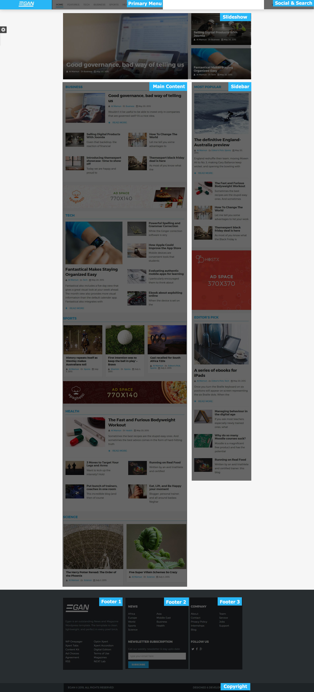

This documentation will flip you  through the step by step how to install and setup the incredible Egan WordPress theme.  Egan is an responsive news and magazine theme for WordPress lovers, those who are looking for a indispensable media to share their discoveries and latest news.

This beautiful news WordPress theme is neat and clean, well-equipped with innumerous technologies Like Bootstrap 3, Less, Newskit, and a lot more.

## Installation

Follow our [installation guideline](../installation) if you are having problem to install the theme.

## Homepage Settings (Without Installing Demo Data)

*__Step 01__*  
If you want to install Tx Next theme in your website except demo data,  you have to first create a page from `Admin Panel >> Pagers >>  Add New Page` You can see in the image below I have created page called “Home”. 


*__Step 02__*  
When you have created your page, now its time change the page reading for Tx News. To change the page reading for newly created page head to the `Admin Panel >> Settings >> Reading` Check the box next to A static page (select below) under Front Pager display. and select your page in which you display Tx Next content. In my turn Its Home.


## Homepage Settings (After Installing Demo Data)

After finishing all installation process, the very first setting, we recommend to define is Home Page. To have Homepage the same as Tx Next demo, change the following setting:

- Head over to __Admin Panel >> Settings >> Reading__
- Check the box next to __A static page (select below)__ under Front Pager display. Select __Homagepage 1__ under the Front Page title. Flip through the image below.


## Layout Structure

This screenshot will give a quick overview of the layout structure of Tx Next WordPress theme.



### Header Settings

The headers contains a couple of widget. To set the header as the Demo looks, please flip through the instruction carefully: 

### Primary Menu Settings
Navigate to `Dashboard >> Appearance >> Menus` and create the primary menu. The primary Menu Look like the following.


__Frontend View__  


### Max Mega Menu Theme Import

Primary menu is using Max Mega Menu theme to give engaging megamenu. If you want to have menu like our Demo theme. Head over to `Dashboad >> Appearance >> Max Mega Menu >> Tools`. Open up  __max-megamenu.txt__ from Themes to dummy-data folder. Copy the entire code of max-megamenu.txt and paste it in __Import Theme__ text field.


### Search box Settings

Navigate to `Dashboard >> Appearance >> Widgets` and place the Search widget into Search box widget area.


### Slideshow Settings

Slide show is another interactive layout of Newskit. Just navigate to `Dashboard >> Appearance >> Widgets >> Slideshow`, then drag & drop Newskit into Slideshow as shown below:


__Frontend View__  


### Main Content – Newskit - Static Layout 1

Navigate to `Dashboard >> Appearance >> Widgets >> Main Content`, drag & drop Newskit into Main Content.


__Frontend View__  


### Main Content –  Ads Banner

*__Step 01__*  
Go to `Dashboard >> Media >> Add New`

Back-end Settings

- Upload Image or select existing image
- Copy the link of the image


*__Step 02__*  
Head over WordPress `Administration >> Appearance >> Widgets`

- Click and drag Text Widget to Main Content

After that use the HTML code below , paste them into Text widget to display the image and the recommend size for the image on the ads banner is `770 x 140`

```
<a href="http://www.themexpert.com/joomla-templates/spaghetti" target="_blank"></a>
```

__Frontend View__


### Main Content – Newskit - Static Layout 2

Navigate to `Dashboard >> Appearance >> Widgets > Main Content`, drag & drop Newskit into Main Content.


__Frontend View__


### Main Content – Newskit - Dynamic Layout 1

Navigate to `Dashboard >> Appearance >> Widgets > Main Content`, drag & drop Newskit into Main Content.


__Frontend View__


## Sidebar Setting

The sidebar areas are used to display the widgets in the secondary column. To get the image sidebar like our demo site, please add the following widget with content and setting, I am going to describe you.

### Sidebar – Newskit: Most Popular ( Static Layout 4 )

Navigate to `Dashboard >> Appearance >> Widgets >> Sidebar` drag & drop Newskit into Sidebar.

*__Backend Settings__*  


__Frontend View__  


### Sidebar–  Ads Banner (Position 1,3,5)
*__Step 01__*  
Go to `Dashboard >> Media >> Add New`

- Upload Image or select existing One
- Copy the link of the image

*__Step 02__*  
Head over WordPress `Administration >> Appearance >> Widgets` Click and drag Text Widget to Sidebar.

After that use the HTML code below , paste them into Text widget to display the image and the recommend size for the image on the ads banner is `370 x 370`
```
<a href="#"></a>
```

__Frontend View__  


## Footer 1

Head to `Administrator >> Appearance >> Widgets >> Footer 1` Find Text and Custom Menu Widget from the list of the Widgets, click and drag it to Footer 1.

__Backend View__  


__Frontend View__  


## Footer 2

Head to `Administrator >> Appearance >> Widgets >> Footer 2` Find Text and Custom Menu Widget from the list of the Widgets, click and drag it to Footer 2.

__Backend View__  


__Frontend View__  


## Footer 3

Head to `Administrator >> Appearance >> Widgets >> Footer 3` Find Text Widget from the list of the Widgets, click and drag it to Footer 3.

__Backend View__  


__Frontend View__  


## Customizer Settings

There are several customizing options in theme customizer like Logo settings, Presets, Social Links etc, to get those settings go to `Administrator >> Appearance >> Customize`


