Installing a WordPress theme is the same as the other, you can either install via FTP or WordPress uploader from wordpress backend.

If you don’t have WordPress install in your server, you can install our QuickStart pack, that are incorporated with required dependency like plugins, demo data, every wordpress itself. Just download the quickstart zip file and you are ready to go. 

Here we will show the full installation process of our Next News & Magazine theme.

## Install via FTP

*__Step 01__*  
Download the zip file of Next theme titled Next_UNZIPFIRST.zip, make sure you have properly extracted the theme. Remember only extracted theme going works smartly in server. When you unzip the Next_UNZIPFIRST.zip, Next folder comes up. Get into the next folder, you will find the following folder.

- Licensing
- Plugins
- Quickstart
- Themes

*__Step 02__*  
Now open the Themes folder, extrect the tx-next.zip file. Now Head over to the Hosting via FTP client, upload the extracted tx-next theme in themes folder of WordPress via `WordPress >> wp-content >> themes`.

*__Step 03__*  
When you’ve done, log in WordPress backend and activate Tx Next Theme via `Dashboard >> Appearance >> Themes`

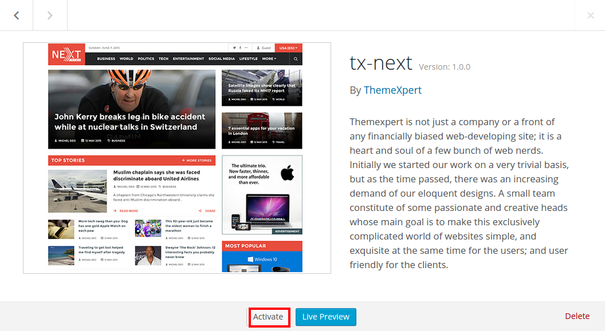

### Plugins Installation

After properly activating WordPress, you will be redirected to the welcome screen of Tx Next theme, and notified with a massage to inform recommended and indispensable plugins. They are NewsKit, TX Tabbar, Max Mega Menu, Akeeba Backup Core, W3 Total Cache, Wordpress Importer. 

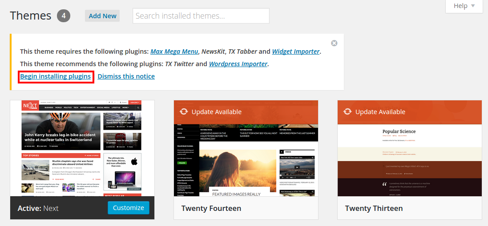

The above message indicated that you can select buttons either. But click on the __Begin installing plugins__ install you all the plugins, not activate those. 

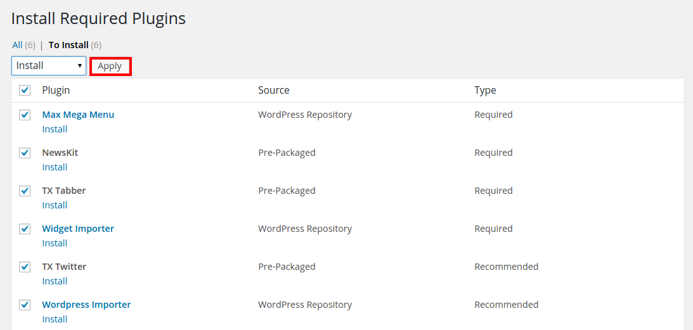

After checking all plugins, select install for apply dropdown, and click apply button. The subsequent step printed in the following. 

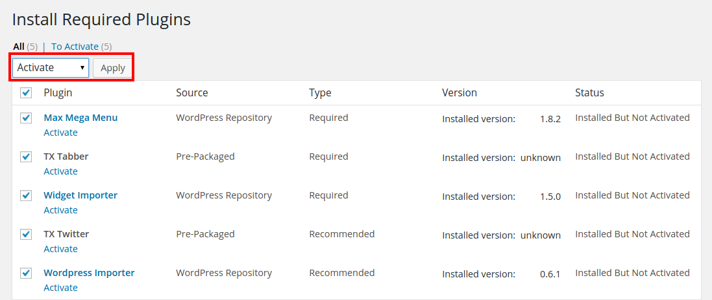

Now check again all available plugins, select Active from Apply dropdown, and click Apply. It will take couple of second to be installed.

*__Note:__* You must install the required plugin and recommended depends on your choice. 

### Import Demo Data

*__Step 01__*  
If you have installed our recommended plugin WordPress Importer, click import from Tool setting via `Dashboard >> Tools >> Import`. It’ll ask to import data from numerous CMS, you must click the WordPress, Have a look at the next image below.

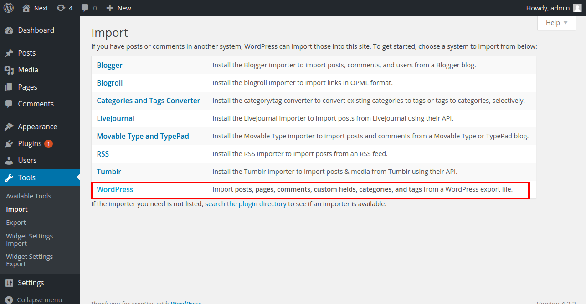

*__Step 02__*  
Now the importer ask you to navigate to the file, that import you all demo data. So, navigate to the Themes folder to dummy-data, select __dummy-content.xml__

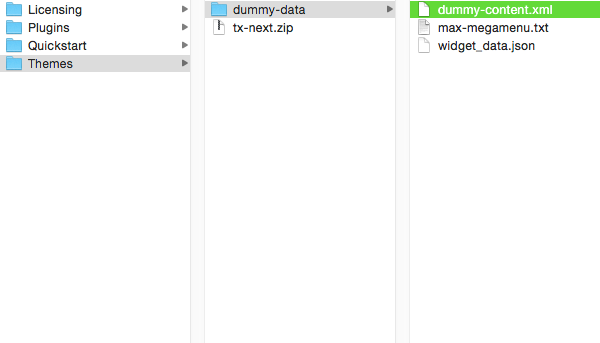

When you select the dummy-content.xml data, the next screen comes up to ask you to click Submit button.

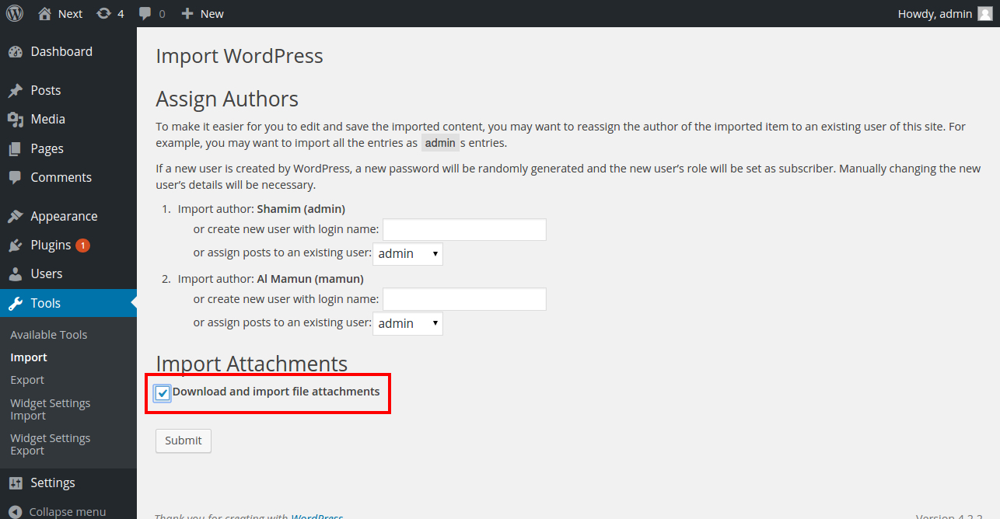

Don’t forget to check Download and import file attachment, It’ll install you all our image files and demo content from our server. By this time, you can have a cup of coffee, because it going to take couple of minutes to install based on your internet 

*__Step 03__*  
Now it’s time to install widget dummy data, it  will bring all the setting we have enabled in the Tx Next WordPress theme. So, Head over to `Dashboard >> Tools >> Widget Setting Import`, click __Select a file__ to navigate to widget_data.json from Themes to dummy-data folder.

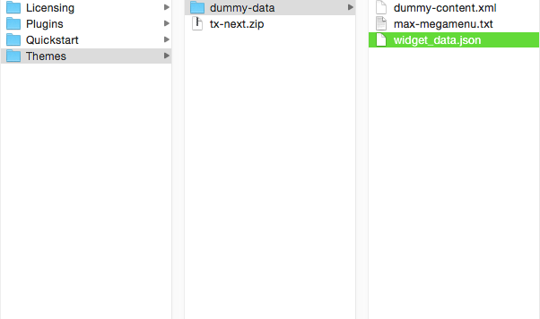

When you selected widget_data.json file, click __Show Widget Settings__. It will bring up the next screen.

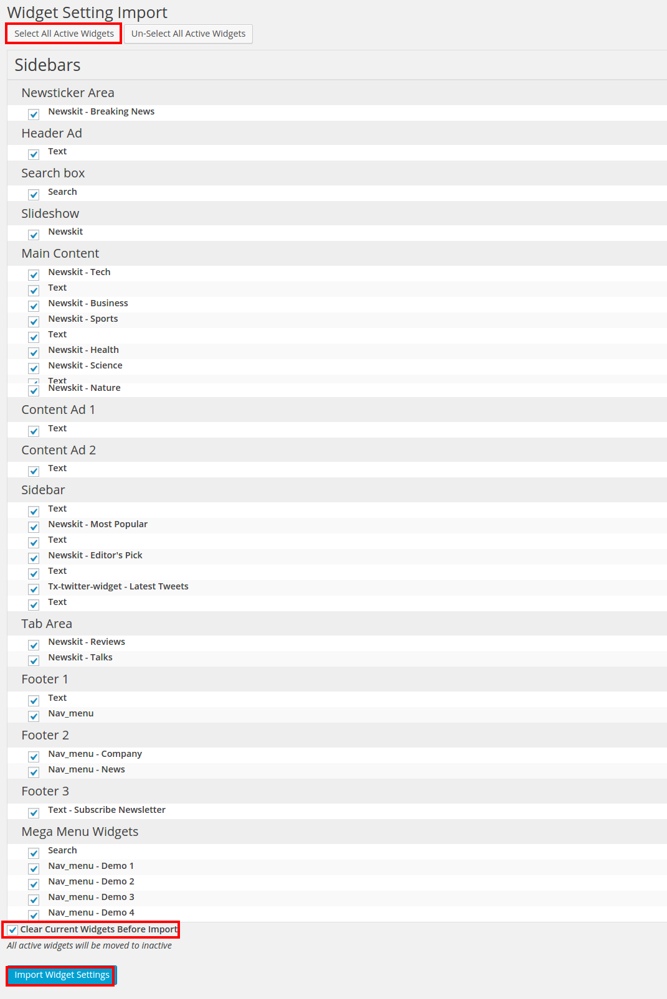

*__Step 04__*  
Click on the __Select All Active WIdget__ and hit __Import Widget Settings__, Be sure about __Clear Current Widget Before Import checking__, It’ll clear all your available widget, you may lose valuable content or hours of work If you have such kind of Widget install in your WordPress.

### Primary Menu Settings

To set your primary menu, head to the `Dashboard >> Appearance >> Menu`. Select __Header Menu (Primary Menu)__ from the __Select a menu to edit:__ dropdown, click Select button.

Scroll down to the page button, you’ll find __Menu Settings__, Check to __Primary Menu__ next to Theme Location and hit Save button. Now Peep into the next image.

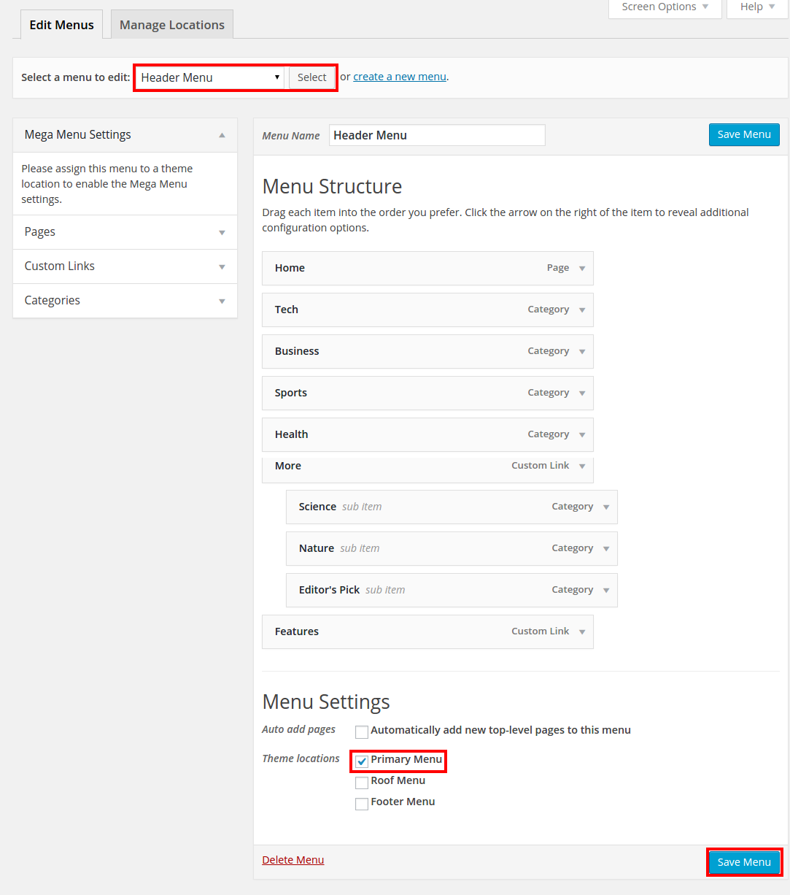

## Install via QuickStart Pack

Quickstart comes all dependency installed with theme including demo data, required as well as recommended plugins, and even WordPress latest version. Quickstart is easy to setup. Have a look on step by step process. 

*__Step 1__*  
When you extracted Next_UNZIPFIRST.zip, you might notice Quickstart folder. Get into the folder and extract __tx-next-quickstart.zip__ file. Make sure you have properly extracted zip file. Remember only extracted theme going works smartly in server.

*__Step 2__*  
Head over to the Hosting via FTP client, upload the extracted tx-next-quickstart folder in your server root directory. and access the the folder from the URL below.

[YourDomainName/Installation](#)

After accessing Quickstart pack of Tx Next theme from URL, the following screen comes up. Click on the next blue button from the top right corner of the screen. 

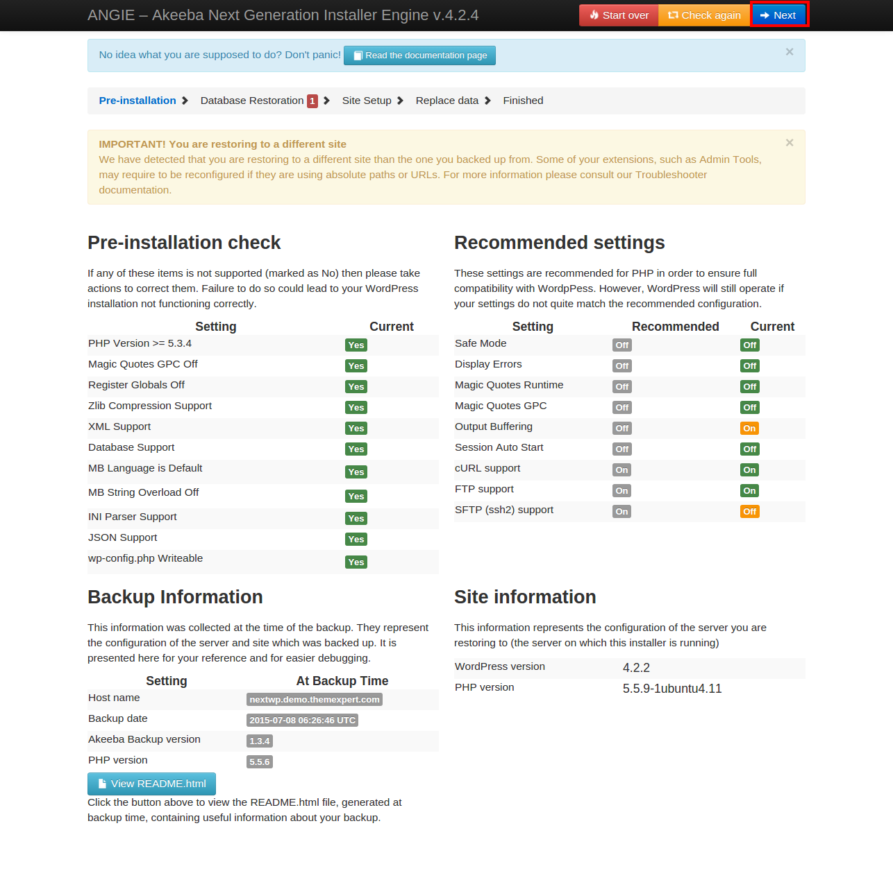

*__Step 03__*  
Add your Database server host name, User name, Password, and Database name  and hit next blue button from top right corner of the screen.

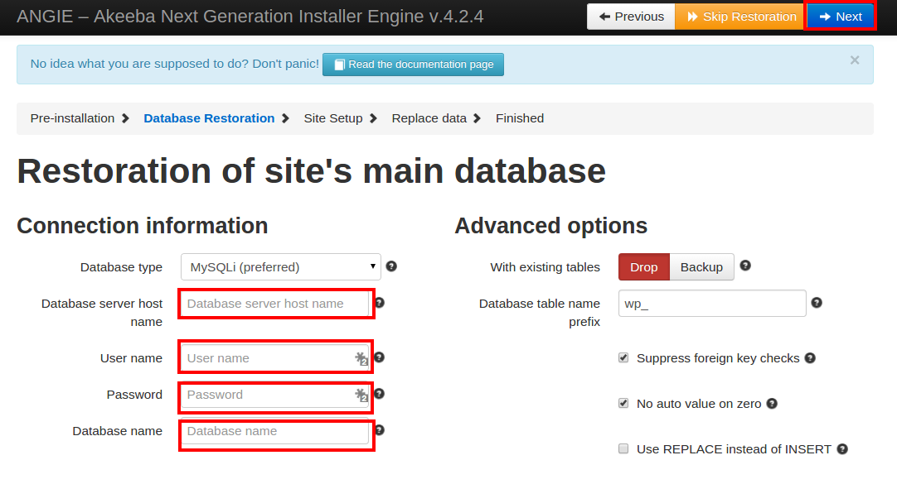

Subsequently a pop up comes with a success message, click next green button.

*__Step 04__*  
Now fill the red lined field with you own credential email and password, lastly click next button. 

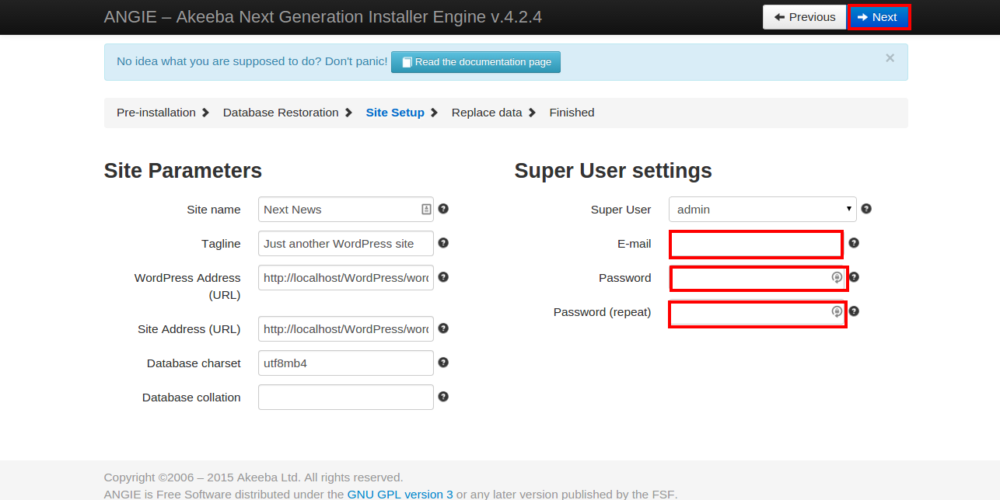

*__Step 05__*  
Now demo data is going to install your server, Make sure To comes with your site domain like [YourDomainName](#). Your site links comes with any extra prefixes, remove them by yourself.

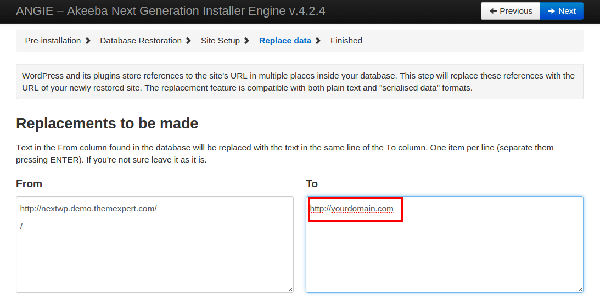

The subsequent screen comes with the following screen. It takes  couple seconds to finish the automated process. Don’t click Next button in this turn, let the system finish it internal process.

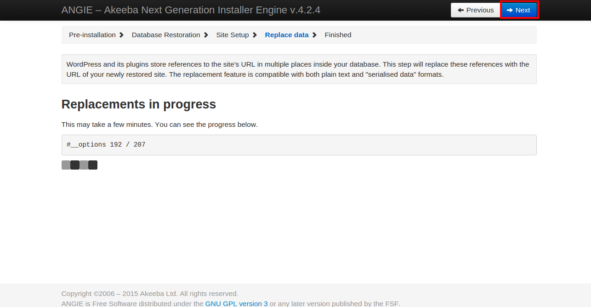

*__Step 06__*  
In the final step, the following screen comes up. Click red button titled __Remove the Installation Directory__

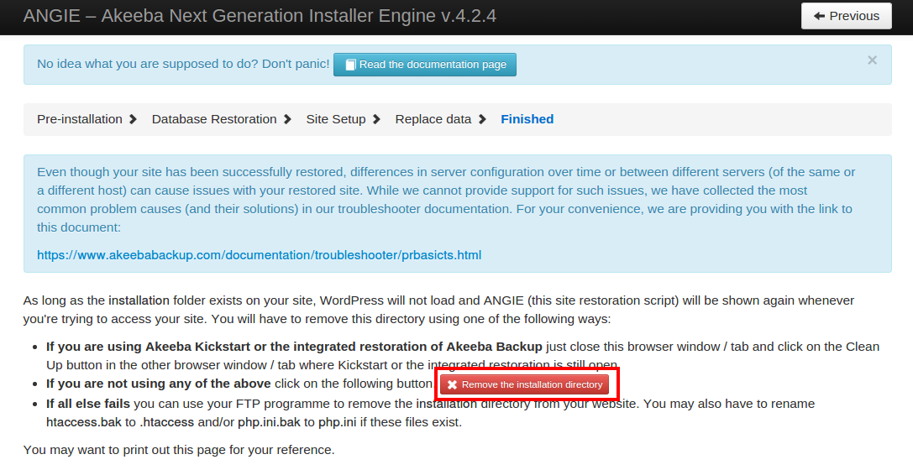

Now a popup screen comes with, click on the green button “Visit your site's front-end”

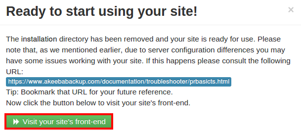