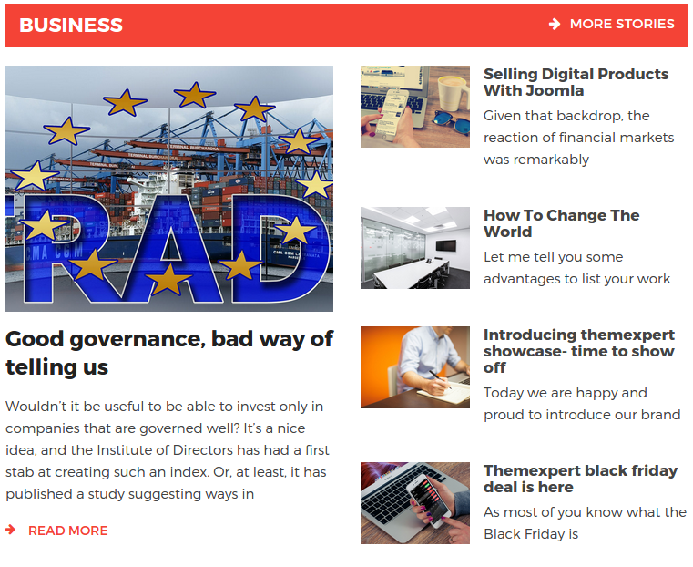
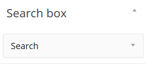
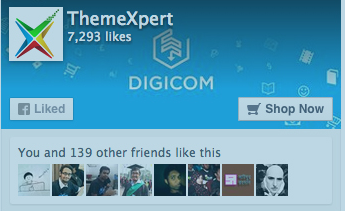
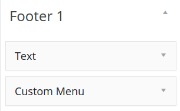
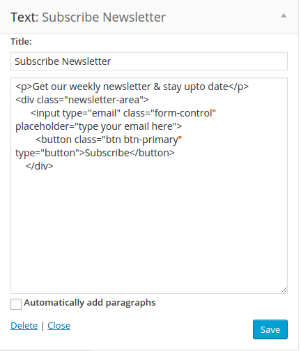

This documentation will flip you  through the step by step how to install and setup the incredible Next WordPress theme.  Next is an responsive news and magazine theme for WordPress lovers, those who are looking for a indispensable media to share their discoveries and latest news.

The beautiful news WordPress theme is neat and clean, well-equipped with innumerous technologies Like Bootstrap 3, Less, Newskit, tabbar, and a lot more


#### Our Recommended Plugins

- W3 Total Cache by Frederick Townes
- WordPress Importer by wordpressdotorg 
- WP Smush by WPMU DEV 
- WordPress SEO by Yoast by Team Yoast


## Installation

Follow our [installation guideline](../installation) if you are having problem to install template.

## Homepage Settings (Without Installing Demo Data)

*__Step 01__*  
If you want to install Tx Next theme in your website except demo data,  you have to first create a page from __Admin Panel >> Pagers >>  Add New Page__. You can see in the image below I have created page called “Home”. 


*__Step 02__*  
When you have created your page, now its time change the page reading for Tx News. To change the page reading for newly created page head to the __Admin Panel >> Settings >> Reading__. Check the box next to A static page (select below) under Front Pager display. and select your page in which you display Tx Next content. In my turn Its Home.


## Homepage Settings (After Installing Demo Data)

After finishing all installation process, the very first setting, we recommend to define is Home Page. To have Homepage the same as Tx Next demo, change the following setting:

- Head over to __Admin Panel >> Settings >> Reading__
- Check the box next to __A static page (select below)__ under Front Pager display. Select __Homagepage 1__ under the Front Page title. Flip through the image below.


## Available Widget

All available widgets can be configured from __Admin Panel > Appearance > Widgets__. There are many of widgets are available but I am going to describe those are used in the theme. They are NewsKit, Tx Tabber, Tx Twitter Widget.

### 01.NewsKit

Newskit is the specialized plugin for WordPress news website, we crafted it for the artistic and coherent presentation of news. We’ve developed the mighty widget Newskit specially for Tx Next, so that You will have soothing relaxation running your site online. Let me explain you first, how powerful and timesaver plugin the Newskit is and how awesome it looks in the backend.


__Content Filter__  
The incredible and indispensable benefit of the Newskit widget is the instant switching between latest and popular post filter, that allow you to present news based  either on its popularity or newness. Latest filer fetch the latest news, and Popular filter fetch the popular news.


__Layout__  
The main motto of Newskit WIdget plugin is present news in innumerous layouts.  The layout in Newskit is divided in static and dynamic category. Static layout has been bottled with 4 layout variation, and dynamic with 5. Even every layout comes with the individual settings of individual layout variation.

When you click on Select Layout, It will open up modal window to select the static layout and dynamic layout with numerous variation. Have a look on them.  


*Static Layout Variations*  


*Dynamic Layout Variations*


So, If you have sound knowledge of PHP and WordPress plugins convention, you can add as much as layout you want. Now walk-through the layout variation both static and dynamic layout. Now it’s time to describe how those layout are presenting news in Tx next.

### 1.1 Newskit: Static Layout 01

Newskit: Static Layout 01 is used to display news first child persisting in presiting in full-width, and others are chunked in 50% and 50% columns. 

__Backend View__  


__Frontend View__  


### 1.2 Newskit: Static Layout 02

Newskit: Static Layout 02 display news in two column. The very first column shows the first child of the post, the subsequent column displays the assigned entire post. 

__Backend View__  


__Frontend View__  


### 1.3 Newskit: Static Layout 03

The list style shows the all assigned news in the list style. How many you assign the number of post, the same number of post will be visible in frontend.

__Backend View__  


__Frontend View__  


### 1.4 Newskit: Static Layout 04

The list style shows the all assigned news in the single row. The very first post will show in largely in the first and other as thumbnail. 

__Backend View__  


__Frontend View__  


### 1.5 Newskit: Dynamic Layout 02  (Main Slider above the fold)

The dynamic layout shows the dynamic content in slider, This slider shows contents in two grids. first grid shows larger content other shows contents depends on its assigned all value.

__Backend View__  


__Frontend View__  


### 1.6 Newskit: Dynamic Layout 03

This dynamic layout show content in grid layout, that slide the content vertically in slideshow. 

__Backend View__  


__Frontend View__  


### 1.7 Newskit: Dynamic Layout 05 (News Ticker)

This dynamic layout is great way to showing latest and the most prioritized content just like latest news. 

__Backend View__  


__Frontend View__  


## Layout Structure

This screenshot will give a quick overview of the layout structure of Tx Next WordPress theme.


### Header Settings

The headers contains a couple of widget. To set the header as the Demo looks, please flip through the instruction carefully: 

__Newsticker Settings__

Navigate to `Dashboard >> Appearance >> Widgets >> Newsticker Area`, Found the couple of settings, Widget Title, Select Category, Number of Post, Title length should be filled with the data shown in the Backend Setting Image. If you want to configure Tx Next with your own setting, you can change the following settings

__Backend View__  


__Frontend View__  


### Primary Menu Settings
Navigate to `Dashboard >> Appearance >> Menus` and create the primary menu. The primary Menu Look like the following.


__Frontend View__  


### Max Mega Menu Theme Import

Primary menu is using Max Mega Menu theme to give engaging megamenu. If you want to have menu like our Demo theme. Head over to `Dashboad >> Appearance >> Max Mega Menu >> Tools`. Open up  __max-megamenu.txt__ from Themes to dummy-data folder. Copy the entire code of max-megamenu.txt and paste it in __Import Theme__ text field.


### Search box Settings

Navigate to `Dashboard >> Appearance >> Widgets` and place the Search widget into Search box widget area.



__Frontend View__  


### Slideshow Settings

Slide show is another interactive layout of Newskit. Just navigate to `Dashboard >> Appearance >> Widgets >> Slideshow`, then drag & drop Newskit into Slideshow as shown below:


__Frontend View__  


### Main Content Settings

This the screenshot of position division of Main content one the Homepage.


### Main Content – Newskit - Static Layout 1 ( Position 1, 6)

Navigate to `Dashboard >> Appearance >> Widgets >> Main Content`, drag & drop Newskit into Main Content.


To show many Newskit( Static Layout 1) at the same time, Just drag & drop, Have a look on the image below we adjust ours.


__Frontend View__  


### Main Content –  Ads Banner (Position 2, 8)

*__Step 01__*  
Go to `Dashboard >> Media >> Add New`

Back-end Settings

- Upload Image or select existing image
- Copy the link of the image


*__Step 02__*  
Head over WordPress `Administration >> Appearance >> Widgets`

- Click and drag Text Widget to Main Content

After that use the HTML code below , paste them into Text widget to display the image and the recommend size for the image on the ads banner is `770 x 140`

```
<a href="http://www.themexpert.com/joomla-templates/spaghetti" target="_blank"></a>
```

__Backend Settings__


__Frontend View__


### Main Content –  Ads Banner (Position 5)
*__Step 01__*  
Go to `Dashboard >> Media >> Add New`

__Back-end Settings__

- Upload Image or select existing image
- Copy the link of the image


*__Step 02__*  
Head over WordPress `Administration >> Appearance >> Widgets`

- Click and drag Text Widget to Main Content

After that use the HTML code below , paste them into Text widget to display the image and the recommend size for the image on the ads banner is `370 x 140`

```
<div class="row hidden-xs">
	<div class="col-md-6 col-sm-6 col-xs-6">
		<a href="http://www.themexpert.com/joomla-templates/bizcorp" target="_blank">
			
		</a>
	</div>
	<div class="col-md-6 col-sm-6 col-xs-6">
		<a href="#">
			
		</a>
	</div>
</div>
```

__Backend Settings__


__Frontend View__


### Main Content – Newskit - Static Layout 3 ( Position 4,9)

Navigate to `Dashboard >> Appearance >> Widgets > Main Content`, drag & drop Newskit into Main Content.


__Frontend View__


### Main Content – Newskit - Static Layout 2 ( Position 3,7)

Navigate to `Dashboard >> Appearance >> Widgets > Main Content`, drag & drop Newskit into Main Content.


__Frontend View__


## Tx Tabber

Tx Tabbar allow you to group other widget in a beautiful tabs, In this section we inserted Newskit: Reviews, Newskit: Talks in the Tx Tabbar. 

Drag and drop both the widget into Tx Tabbar section as show below:


__Frontend View__


## Sidebar Setting

The sidebar areas are used to display the widgets in the secondary column. Check the following screenshot how sidebar awesome alone. 

To get the image sidebar like our demo site, please add the following widget with content and setting, I am going to describe you.

### Sidebar–  Ads Banner (Position 1,3,5)
*__Step 01__*
Go to `Dashboard >> Media >> Add New`

*__Back-end Settings__*

- Upload Image or select existing One
- Copy the link of the image

*__Step 02__*
Head over WordPress `Administration >> Appearance >> Widgets` Click and drag Text Widget to Sidebar.

After that use the HTML code below , paste them into Text widget to display the image and the recommend size for the image on the ads banner is `370 x 370`
```
<a href="#"></a>
```

*__Backend Settings__*  


__Frontend View__  


### Sidebar – Newskit: Most Popular ( Static Layout 4 - Position 2, 3 )

Navigate to `Dashboard >> Appearance >> Widgets >> Sidebar` drag & drop Newskit into Sidebar.

*__Backend Settings__*  


__Frontend View__  


### Sidebar – Latest Tweets: Latest Tweets ( Position 6 )

Navigate to `Dashboard >> Appearance >> Widgets >> Sidebar` drag & drop Tx Twitter Feed Widget into Sidebar. Make sure to input your Twitter Consumer key, Consumer Secret, Access Token, Access Token Secret in the blurred field. If you are thinking where to find those keys, just visit this [link](https://apps.twitter.com/app/new), Create your Twitter application, finally have your app codes.


__Frontend View__  


### Sidebar – Text ( Position 7 )

Navigate to `Dashboard >> Appearance >> Widgets >> Sidebar`, drag & drop Text into Sidebar. This widget enable you a widget, that fetch your like page widget. To have your facebook page in your website, visit this [link](https://developers.facebook.com/docs/plugins/page-plugin).  Entry your essential parameters and generate your API code clicking on Get Code button. And paste in following text widget.


__Frontend View__  



## Footer Settings 

Here is the total appearance of total footer


### Footer 1

Head to `Administrator >> Appearance >> Widgets >> Footer 1` Find Text and Custom Menu Widget from the list of the Widgets, click and drag it to Footer 1.



__Backend View of Text Widget__  


__Backend View of Custom Menu__  


__Frontend View__  


### Footer 2

Head to `Administrator >> Appearance >> Widgets >> Footer 2`. Find Custom Menu Widget from the list of the Widgets, click and drag two sets of Custom Menu to Footer 2


__Backend View of Custom Menu:Company__  


__Backend View of Custom Menu: News__  


__Frontend View__  


### Footer 3

Head to `Administrator >> Appearance >> Widgets >> Footer 3` Find Text Widget from the list of the Widgets, click and drag Text Widget to Footer 3


__Backend View of Text: Subscribe Newsletter__  


__Frontend View__  
