##Installation
----------
Installing Switch is similar to installing any other WordPress theme. After Downloading you will get a zip file . That is your main zip file. Upload it using WordPress's theme uploader and activate it. Depending on your settings, you can immediately see the welcome blog page or landing page. 

###Post Installation Tasks
----------

After installating and activating Switch theme, you need to perform the following tasks to enable landing page. 

- Go to WordPress Admin Panel's Settings Menu, click on Permalink and pickup one (we suggest that you pick up postname) and click on Save
- Create a new page. Enter "Homepage" as title and keep the content field blank. Now select "Home Page" as page template from the right side page template dropdown menu. Now save/publish it.
- Go to Settings Menu again, click on Reading. From the "Front Page Settings" section, click on static page, and select previously created HOME PAGE from the dropdowns as shown in the picture below and save.

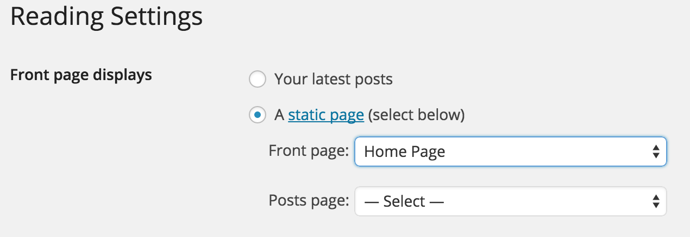

##Switch Theme Management
----------
Switch comes with a fantastic a powerful admin panel from where you can update almost every part of the theme. Just go to your WordPress admin panel and click on Switch settings. 

###Global Settings
----------
From the Global Settings sections, you can change logo. The management panel looks like this.
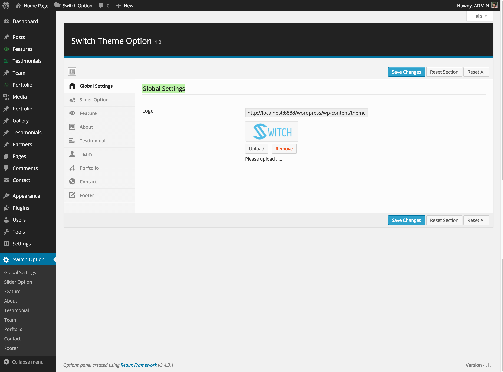

###Slider Option
----------

From this section in Switch settings, you can manage the homepage Slider. This section looks like the following screen.

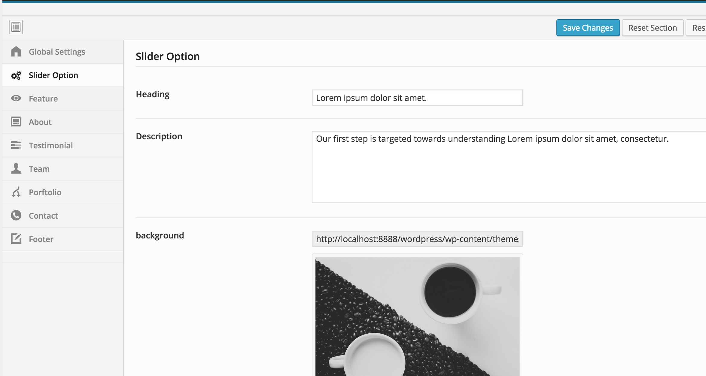

###Features
----------
Feature section also requires that you create a feature post first, then tune up the look-n-feel from the feature settings area. 
Creating a Feature is easy by going to "Feature" and click on "New Feature" on the left side menu. 

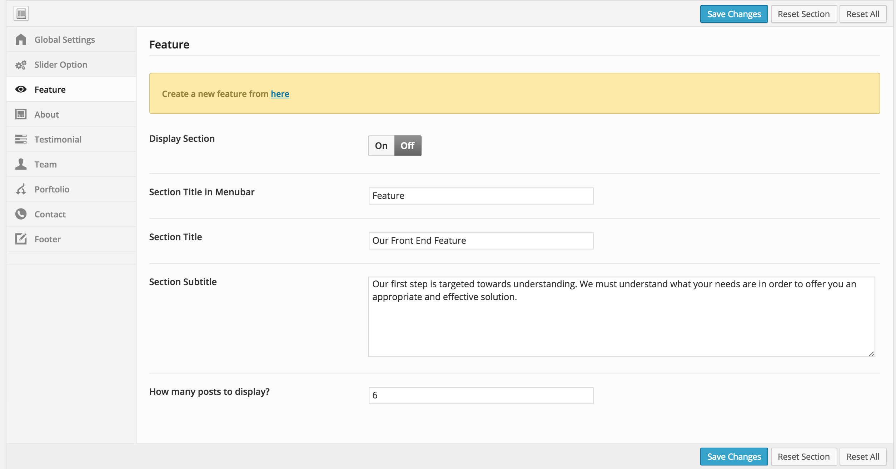

###About
----------

From About settings, you can add as many About section details. 
About settings looks like the following screen. You can turn it off and also change the menu title from here. 

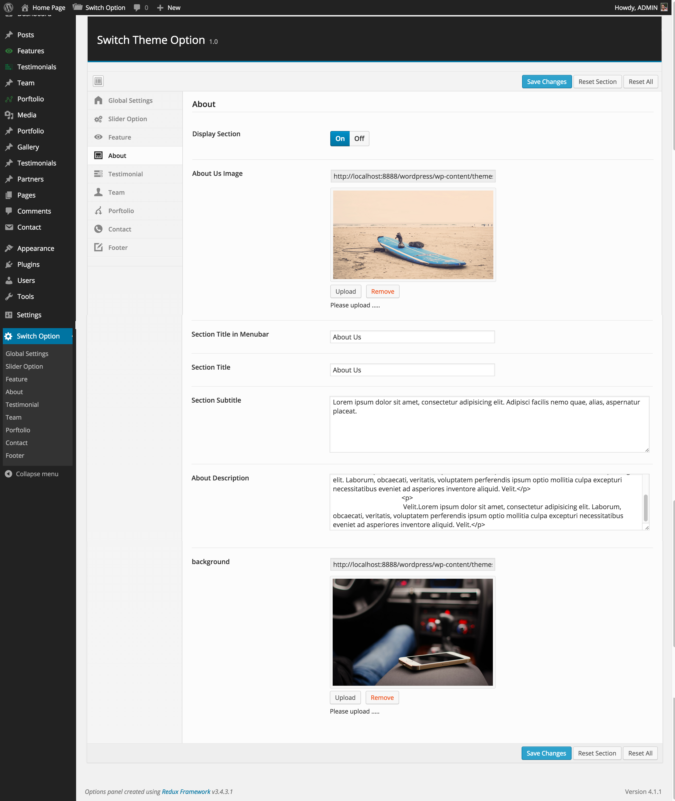

###Testimonials
----------

Testimonial section also requires that you create a testimonial post first, then tune up the look-n-feel from the testimonial settings area. 
Creating a testimonial is easy by going to "Testimonials" and click on "New Testimonial" on the left side menu. 

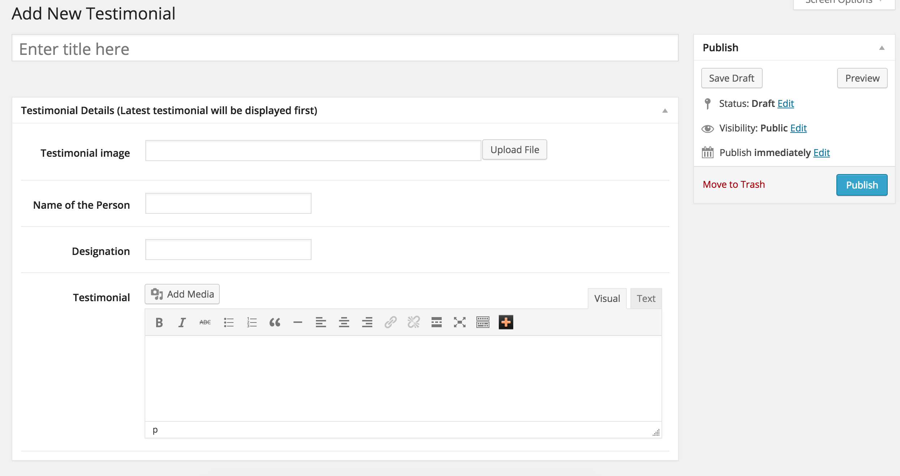

The settings screen look like this

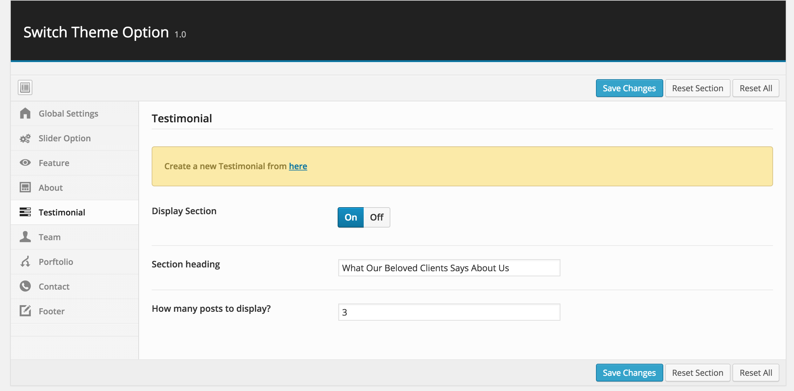

###Team
----------

Team section also requires that you create a Team post first, then tune up the look-n-feel from the Team settings area. 
Creating a Team is easy by going to "Teams" and click on "New Team" on the left side menu. 

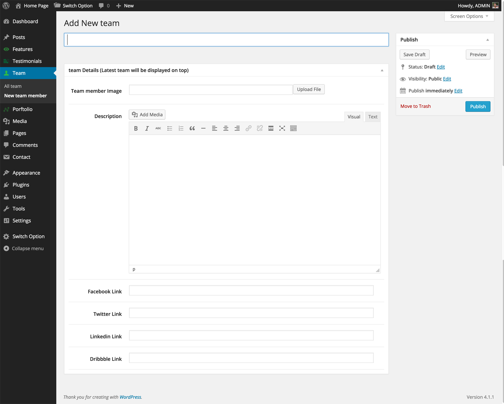

The settings screen look like this

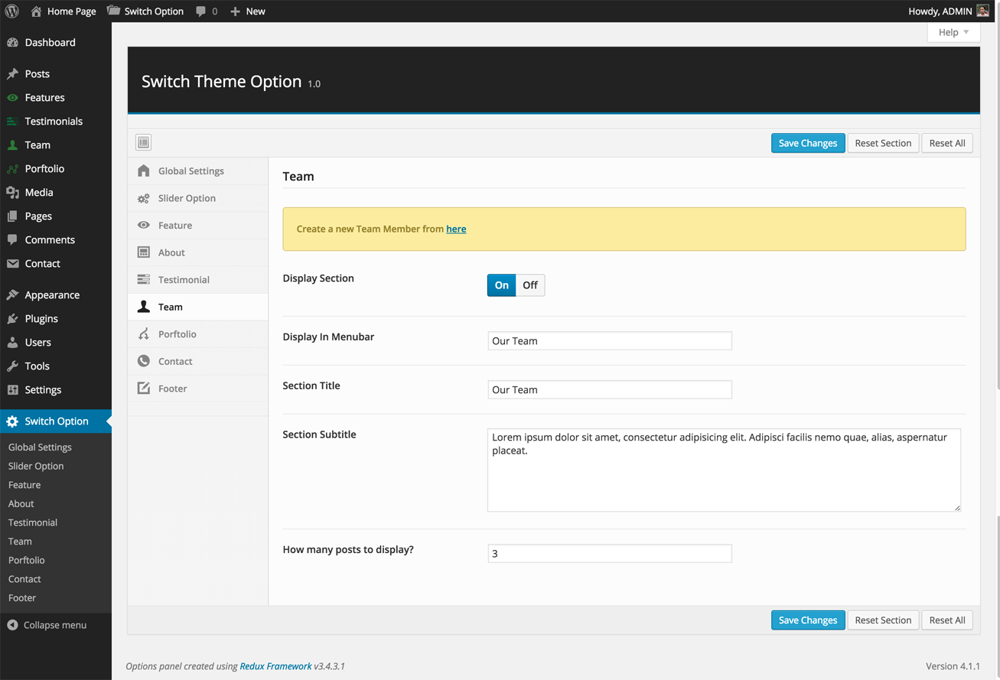

###Portfolio
----------

In Switch you can create unlimited portfolio galleries and select any one to display any time. To create a nice portfolio, go the Portfolio in the left menu in WordPress admin and click on "New Portfolio". From here, you canadd unlimited photos to this gallery

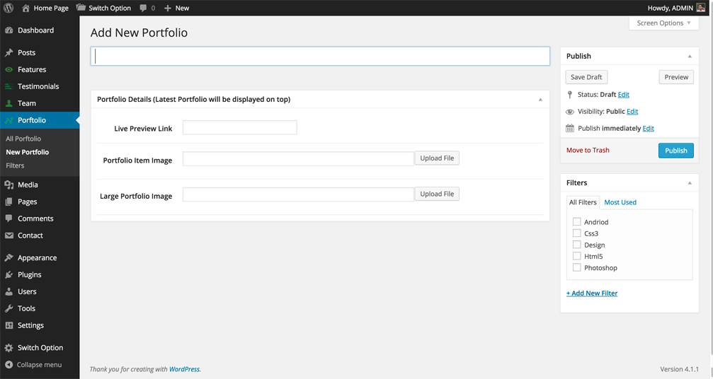

While adding an item, you can specify their Filtes.

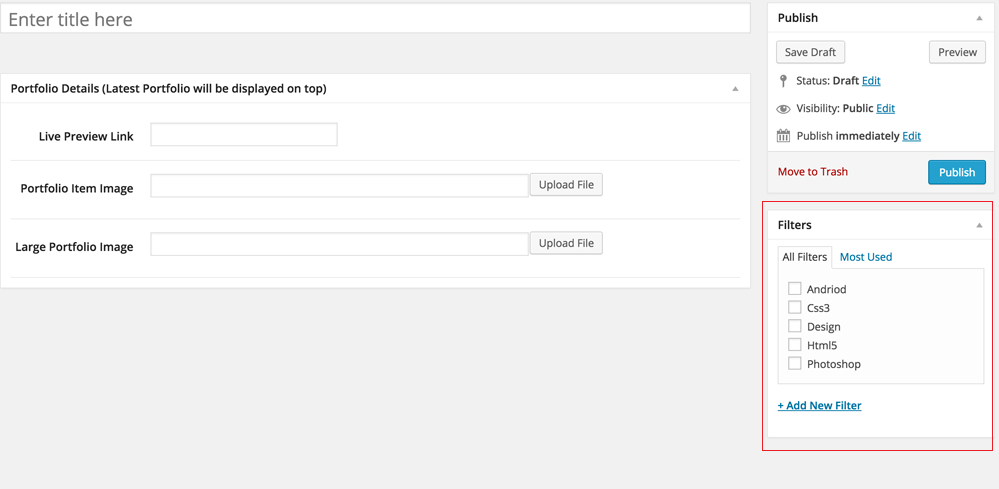

The settings screen look like this

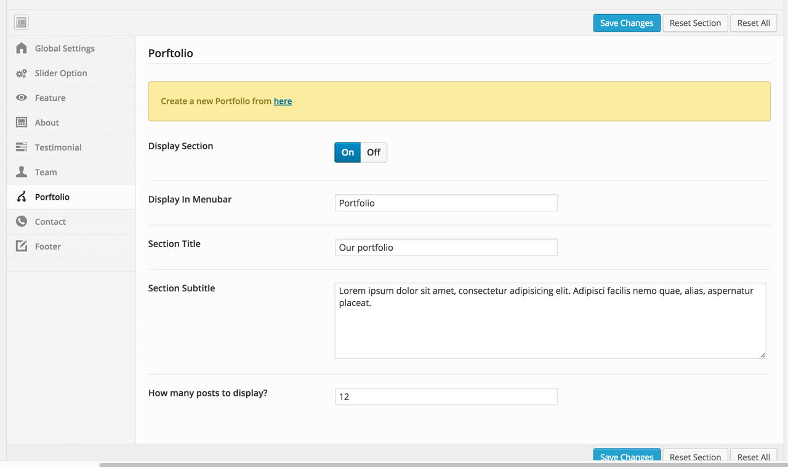

###Contact
----------

From contact area, you can specify your contact details as well as who will receive the contact emails. You can also specify the google map. 

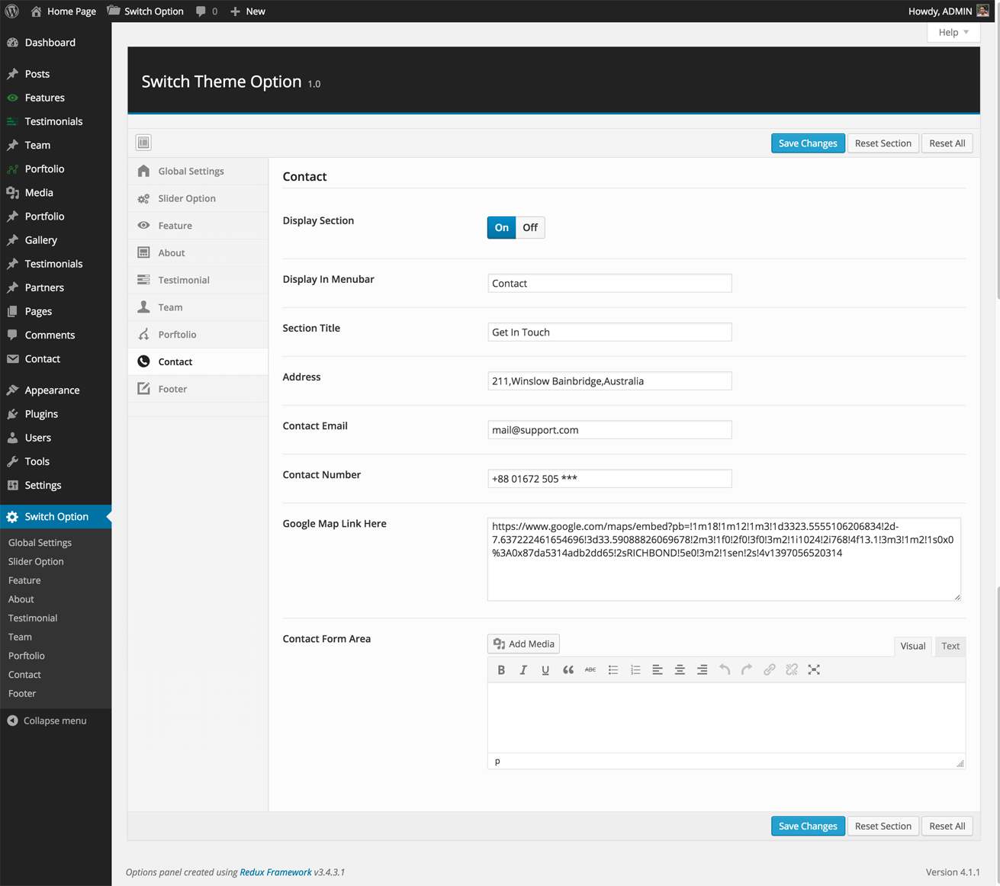

####Contact from
----------
when you install the theme it requires a plugin called contact form 7. Just install that plugin and opne it. You will get a shortcoad . please copy that code and paste it into theme option .

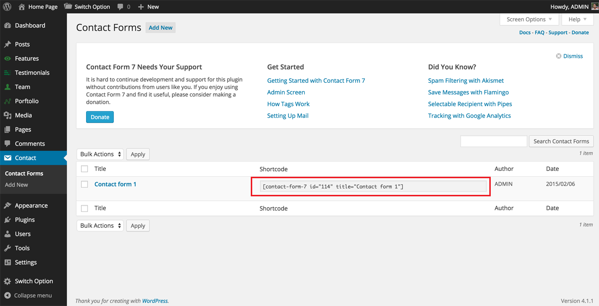

